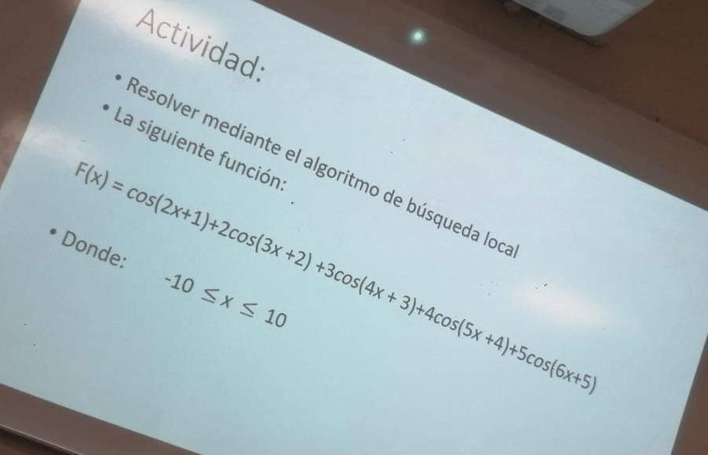

## Sistemas Inteligentes

### Ejercicio 1:
Desarrollar la función de colorear del **pseudocódigo** siguiente para el ejercicio de coloración de grafos:

### Ejercicio 2:

Probar el ejercicio de mapa de Rumania del libro: **Intelligence A Modern Approach (2nd Edition)**.

Con los siguientes tres algoritmos de búsqueda implementados en el libro:
* BFS
* DFS
* UCS

Comparar el **tiempo y la memoria** con cada algoritmo de búsqueda empleado.

### Ejercicio 3:  
Encontrar los **minimos** y **maximos** usando el algoritmo de **hill climbing** para la función de **Hubert**.

### Ejercicio 4:
Resolver el ejercicio de las **8 reinas** con cualquier algoritmo visto en clase, en este caso se uso el de **recocido simulado**.

### Ejercicio 5:
Resolver **sudoku** con alguno de los algoritmos empleados en clase, en este caso se uso **recocido simulado**.
Contando el número de penalizaciones.

### Ejercicio 6:
Resolver la **matriz n x n** usando algun algoritmo visto en clase, en este caso se uso el de **recocido simulado**.

